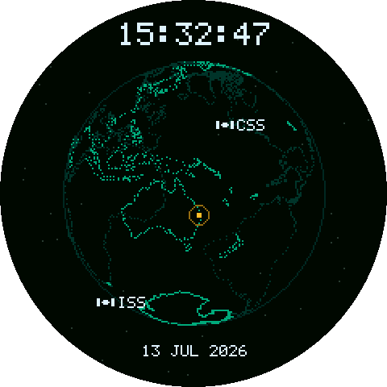

# ORCA Orbital Sentinel — Round Display build (XIAO ESP32-S3)

Standalone firmware for a **Seeed Studio XIAO ESP32-S3** plugged into a **Seeed Studio
Round Display for XIAO** (1.28-inch, 240×240, round GC9A01 panel). No computer attached:
it joins your Wi-Fi, syncs the clock, downloads fresh orbital elements, and runs.

It is a **desk clock that happens to track spacecraft** — a dotted Earth spinning under a
big local-time readout, with the ISS and China's CSS propagated **on-device** with SGP4,
and your own city pinging whenever the Earth's rotation brings it into view.


Those are not mock-ups. They are real frames from the firmware's own renderer, compiled
for a PC and dumped to PNG — same SGP4 positions, same projection, same palette, same
16-bit colour quantisation, same round bezel mask. See
[Preview it without hardware](#preview-it-without-hardware).

**On screen:** the local time (large, centred), the date, ISS and CSS as labelled
satellites that hide when they pass behind the globe, and your location as an amber dot
with an expanding ping ring. The clock, date and both stations share one pale blue so the
readout looks like a single instrument; the stations are told apart by their labels.

For the desktop (Python) version, see the [main README](../README.md).

> **Status.** The firmware is complete, and everything checkable without a panel has been
> checked: the SGP4 port is verified against the reference implementation
> ([Verification](#verification)), the sketch compiles clean for the XIAO ESP32-S3 (33%
> flash, 24% RAM), and the renderer is exercised on every preview build. It has **not yet
> been flashed to physical hardware**, so treat the first upload as bring-up rather than a
> known-good build.

---

## Contents

1. [What you need](#1-what-you-need)
2. [Assemble the hardware](#2-assemble-the-hardware)
3. [Install the Arduino toolchain](#3-install-the-arduino-toolchain)
4. [Install the library](#4-install-the-library)
5. [Smoke-test the panel](#5-smoke-test-the-panel)
6. [Configure and flash](#6-configure-and-flash)
7. [Make it yours](#make-it-yours)
8. [Preview it without hardware](#preview-it-without-hardware)
9. [How it works](#how-it-works)
10. [Verification](#verification)
11. [Troubleshooting](#troubleshooting)

---

## 1. What you need

| Item | Notes |
| ---- | ----- |
| Seeed Studio XIAO ESP32-S3 | Compute + Wi-Fi. Plain S3 or S3 Sense both work; Sense has PSRAM. |
| Seeed Studio Round Display for XIAO | 1.28" round, 240×240, GC9A01, capacitive touch, on-board RTC + TF slot. |
| USB-C cable | Flashing and power. Must be a **data** cable, not charge-only. |
| 2.4 GHz Wi-Fi | Optional — see [Offline behaviour](#offline-behaviour). The ESP32-S3 radio cannot join a 5 GHz-only SSID. |

Other XIAO variants (SAMD21, RP2040, RA4M1) will **not** work: the 240×240×16-bit
framebuffer alone is 115 KB, more RAM than those boards have.

## 2. Assemble the hardware

The Round Display has a pin header on the back sized for the XIAO. Align it and press it
straight in — no soldering.

- Orient it so the XIAO's **USB-C connector faces outward**. With the display facing you,
  USB-C points **right**, and the on/off switch ends up in the lower-left corner.
- **Set the switch to ON.** It controls the backlight. A blank screen after a successful
  upload is almost always this switch.
- Reversing the XIAO won't instantly destroy it (there is protection), but don't leave it
  that way.

## 3. Install the Arduino toolchain

1. Install the **[Arduino IDE](https://www.arduino.cc/en/software)** (2.x).
2. **File → Preferences → Additional boards manager URLs**, add:

   ```text
   https://raw.githubusercontent.com/espressif/arduino-esp32/gh-pages/package_esp32_index.json
   ```

3. **Tools → Board → Boards Manager**, search `esp32`, install **esp32 by Espressif
   Systems**. (It's a large download — a few hundred MB of toolchain.)
4. Select **Tools → Board → esp32 → XIAO_ESP32S3**.

Board settings that matter:

| Setting | Value | Why |
| ------- | ----- | --- |
| Board | `XIAO_ESP32S3` | |
| USB CDC On Boot | **Enabled** | Otherwise `Serial` prints never reach the Serial Monitor over USB. |
| PSRAM | **OPI PSRAM** (if your board has it) | Moves the 115 KB framebuffer off internal SRAM, leaving it for the Wi-Fi stack. |
| Partition Scheme | Default 4 MB with spiffs | |
| Upload Speed | 921600 | |

## 4. Install the library

This firmware needs **exactly one** library: **Seeed_GFX**. That's it. `WiFi`,
`HTTPClient`, and `Preferences` all ship with the ESP32 board package you just installed.

> **You do *not* need `Seeed_Arduino_RoundDisplay`.** That library is only for Seeed's own
> LVGL demos. This firmware talks to the panel directly through Seeed_GFX, and is verified
> to compile with Seeed_GFX alone. (It is also not vendored in this repo — it's an
> unmodified upstream clone, and committing 61 MB of someone else's code helps nobody.)

**Seeed_GFX** is a fork of the well-known `TFT_eSPI` library with the GC9A01 round panel
already supported. It is not in the Arduino Library Manager, so install it by hand.

### Option A — git clone (recommended: easy to update)

Clone it into your Arduino **libraries** folder:

| OS | Libraries folder |
| -- | ---------------- |
| Windows | `%USERPROFILE%\Documents\Arduino\libraries` |
| macOS | `~/Documents/Arduino/libraries` |
| Linux | `~/Arduino/libraries` |

```bash
cd ~/Documents/Arduino/libraries          # Windows: cd %USERPROFILE%\Documents\Arduino\libraries
git clone https://github.com/Seeed-Studio/Seeed_GFX.git
```

This firmware was built and verified against Seeed_GFX **v2.0.3**, commit
[`a2de1ab`](https://github.com/Seeed-Studio/Seeed_GFX/commit/a2de1abca0597c202193f22d01e9fa35d1ff613b).
If a future upstream change breaks the build, pin to that exact commit:

```bash
cd Seeed_GFX
git checkout a2de1abca0597c202193f22d01e9fa35d1ff613b
```

### Option B — ZIP download

1. Go to <https://github.com/Seeed-Studio/Seeed_GFX>.
2. **Code → Download ZIP**.
3. In the Arduino IDE: **Sketch → Include Library → Add .ZIP Library…**, select the ZIP.

### Verify the install

Restart the Arduino IDE. You should see **File → Examples → Seeed_GFX**. If you don't, the
folder is in the wrong place — it must be `…/Arduino/libraries/Seeed_GFX/`, with
`TFT_eSPI.h` directly inside it (not nested in an extra subfolder, which is a common
result of unzipping).

### ⚠️ Remove any existing TFT_eSPI

Seeed_GFX **is** a fork of `TFT_eSPI` and declares the same class names. If you already
have the original `TFT_eSPI` installed, the two will collide and the build will fail with
duplicate-definition or "multiple libraries found" errors. Delete or rename
`…/Arduino/libraries/TFT_eSPI` before continuing.

### How the panel gets selected

Seeed_GFX auto-includes any file called `driver.h` sitting in the sketch folder, and uses
it to pick the board/screen combo.
[`orbital_sentinel/driver.h`](orbital_sentinel/driver.h) already contains the one line
this panel needs:

```c
#define BOARD_SCREEN_COMBO 501  // Round Display for Seeed Studio XIAO (GC9A01)
```

So you do **not** need to hand-edit `User_Setup_Select.h` inside the library, which is the
older method you'll find in some Seeed guides. **Don't do both** — they conflict.

### Optional: the on-board RTC

The Round Display's PCF8563 real-time clock keeps UTC across a power cycle, so the globe
is roughly right even with no network at boot. It is **off by default** to keep the
dependency list at one library. To enable it:

1. **Tools → Manage Libraries…**, search **`I2C BM8563 RTC`**, install it.
2. Change `#define USE_RTC 0` to `1` at the top of
   [`orbital_sentinel.ino`](orbital_sentinel/orbital_sentinel.ino).

## 5. Smoke-test the panel

Before flashing this firmware, prove the panel, toolchain, cable, and switch all work with
a stock example. This isolates hardware problems from firmware problems, and takes two
minutes.

1. **File → Examples → Seeed_GFX → Round Display → Arduino_Life**.
2. That example needs a `driver.h` too: click the **▾** next to the sketch tab → **New
   Tab**, name it `driver.h`, and paste in:

   ```c
   #define BOARD_SCREEN_COMBO 501
   ```

3. Set the display switch to **ON**, pick your board's port under **Tools → Port**, and
   **Upload**.

You should see Conway's Game of Life animating on the round panel. If you do, everything
downstream is a firmware question, not a wiring one.

## 6. Configure and flash

```bash
cd ESP32S3_orbital_sentinel/orbital_sentinel
cp secrets.h.example secrets.h        # Windows: copy secrets.h.example secrets.h
```

Edit `secrets.h` with your Wi-Fi details:

```c
#define WIFI_SSID "your-2.4GHz-network"
#define WIFI_PASS "your-password"
```

`secrets.h` is git-ignored, so your credentials never get committed. Without it the sketch
still compiles and runs — it just starts offline.

Then set your location and timezone in [`config.h`](orbital_sentinel/config.h) (see
[Make it yours](#make-it-yours)), open
[`orbital_sentinel.ino`](orbital_sentinel/orbital_sentinel.ino), check the board and port,
make sure the display switch is **ON**, and **Upload**.

Open the **Serial Monitor at 115200** to watch it come up:

```text
ORCA Orbital Sentinel - round display build
[wifi] joining my-network....
[wifi] ok, ip 192.168.1.42
[tle] source=celestrak tracked=2/2
```

That `source=` line tells you where the orbital elements came from — see
[Offline behaviour](#offline-behaviour).

---

## Make it yours

Everything is in [`config.h`](orbital_sentinel/config.h). The two you almost certainly
want to change are at the top.

### Your location

**South and west are negative.** Get the numbers from any maps app.

```c
#define HOME_ENABLED 1
#define HOME_LAT -27.4698f      // Brisbane
#define HOME_LON 153.0251f
```

### Your timezone

A POSIX TZ string. **The sign is inverted** from what you expect — UTC+10 is written
`-10`.

| Zone | String |
| ---- | ------ |
| Brisbane (UTC+10, no DST) | `"AEST-10"` |
| Sydney / Melbourne (DST) | `"AEST-10AEDT,M10.1.0,M4.1.0/3"` |
| UK | `"GMT0BST,M3.5.0/1,M10.5.0"` |
| US Eastern | `"EST5EDT,M3.2.0,M11.1.0"` |
| US Pacific | `"PST8PDT,M3.2.0,M11.1.0"` |
| Central Europe | `"CET-1CEST,M3.5.0,M10.5.0/3"` |
| UTC (no conversion) | `"UTC0"` |

### The rest

| Knob | Default | Meaning |
| ---- | ------- | ------- |
| `TIME_ACCELERATION` | `1.0f` | Simulated seconds per real second. **1.0 = real time**, so the globe agrees with the clock. Raise it (the desktop uses 90) for a fast screensaver orbit — see the note below. |
| `SPIN_DEG_PER_SEC` | `3.0f` | Cosmetic camera spin: one full turn every 2 minutes. Never affects physics. |
| `HOME_PING_PERIOD_S` | `2.5f` | Seconds per ping. |
| `GLOBE_RADIUS_FRAC` | `0.34f` | Earth radius as a fraction of the panel. |
| `CLOCK_TEXT_SCALE` | `2` | Time readout size (2 → a clear 10×14 font). |
| `COL_LED` | pale blue | The one colour shared by the clock, date, ISS and CSS. |
| `COL_ISS` / `COL_CSS` | `COL_LED` | Override with distinct values to tell the two stations apart by colour rather than by label. |
| `COL_HOME` | amber | Your location — deliberately not a station colour. |
| `TLE_REFRESH_S` | `6 h` | How often to refetch. **Do not lower without reason** — CelesTrak firewalls pollers. |

> **The clock never lies.** The orbits run on *simulated* time; the clock runs on *real*
> wall time. At the default `TIME_ACCELERATION` of `1.0` these are the same thing, which is
> the point — what you read above the globe is where the stations actually are. Raise the
> acceleration for a livelier display and the globe runs ahead, but the clock keeps telling
> the truth.

### Offline behaviour

With no `secrets.h`, no network, or no DNS, the firmware still boots and draws. Element
sets resolve through the same fallback chain the desktop uses, and the serial log says
which one won:

| `source=` | Meaning |
| --------- | ------- |
| `nvs-cache` | A fresh download from a previous boot, still within `TLE_REFRESH_S`. |
| `celestrak` | Fetched live just now. |
| `nvs-cache(stale)` | Cached but past its refresh window; the network was unreachable. |
| `baked-in-fallback` | No network *and* no cache: using the elements in `tle_fallback.h`. |

SGP4 accuracy decays a few km/day away from the element-set epoch, so a station drawn from
stale elements is visibly wrong in *phase* but still traces a plausible orbit — much better
than a blank screen. Refresh the baked-in elements occasionally:

```bash
curl "https://celestrak.org/NORAD/elements/gp.php?GROUP=stations&FORMAT=tle"
```

and paste the ISS (25544) and CSS (48274) lines into
[`tle_fallback.h`](orbital_sentinel/tle_fallback.h).

---

## Preview it without hardware

`tools/preview` compiles the firmware's **real** `render.cpp` and `sgp4.cpp` for your PC
and writes PNGs of exactly what the panel would show. It is how every image on this page
was made, and it means you can iterate on the look of the display with no XIAO plugged in.

```bash
pip install pillow
python tools/preview/build_preview.py                       # one frame
python tools/preview/build_preview.py --frames 8 --step 120 # a sequence
```

The default invocation writes `assets/round_display_preview.png` — one frame with both
stations up and the home marker mid-ping:



Every pixel there has already been through the same RGB565 quantisation the panel applies,
and the round bezel mask is the renderer's own — so if it looks wrong here, it will look
wrong on the hardware.

It needs a C++ compiler. It will use `$CXX`, `g++`, or `clang++` if you have one, and
otherwise falls back to `python -m ziglang c++` (`pip install ziglang` — a complete
compiler in a pip wheel, no toolchain setup required).

| Option | Meaning |
| ------ | ------- |
| `--time` | ISO **UTC** instant of the first frame. |
| `--frames` / `--step` | Frame count, and simulated seconds between frames. |
| `--azimuth` | Camera spin, to reproduce a composition. Any value is a moment the panel really passes through. |
| `--tz-offset` | Hours to add to UTC for the on-screen clock (Brisbane = `10`). |
| `--scale` | Integer nearest-neighbour upscale (keeps the pixels crisp). |
| `--out` | Output path. |

A `--step` of `120` advances the cosmetic spin by exactly 360°, so it's a handy way to
sweep *time* while holding the globe's orientation still.

### Regenerating the coastline

`coastline.h` is generated from the desktop's bundled Natural Earth data. Re-run this if
you change the decimation stride:

```bash
python tools/gen_coastline.py
```

---

## How it works

The interesting code is deliberately **free of any Arduino dependency**, which is what
lets the same source both drive the panel and render the previews above:

```text
orbital_sentinel/
|-- orbital_sentinel.ino   Arduino glue ONLY: Wi-Fi, SNTP, HTTP, NVS cache, TZ, SPI push
|-- sgp4.h / sgp4.cpp      SGP4 (WGS72, near-Earth) + TEME->ECEF + GMST   <- portable core
|-- render.h / render.cpp  orthographic camera + the compact renderer      <- portable core
|-- config.h               YOUR LOCATION, TIMEZONE, palette, timing (no logic)
|-- coastline.h            GENERATED: 2,661 Natural Earth dots, ~10 KB
|-- font5x7.h              the HUD font (owned, so preview == panel)
|-- tle_fallback.h         baked-in element sets, so the globe is never empty
|-- driver.h               #define BOARD_SCREEN_COMBO 501
`-- secrets.h              your Wi-Fi credentials (git-ignored; copy the .example)
```

This mirrors the desktop app's core/renderer split: `sgp4.cpp` is
[`propagate.py`](../orca_orbital_sentinel/propagate.py), and `render.cpp` is
[`camera.py`](../orca_orbital_sentinel/camera.py) +
[`render_small.py`](../orca_orbital_sentinel/render_small.py).

`render.cpp` is *pure*: it takes a fully-resolved `Scene` (positions, ping phase, and
ready-made local time/date strings) and draws pixels. Anything platform-shaped — reading
the clock, applying the timezone — happens in the caller. That is what lets the firmware
and the host preview each do it their own way and still produce identical images.

**Each frame** the firmware advances simulated time, propagates the two stations through
SGP4 into Earth-fixed coordinates, spins the camera, projects everything orthographically
(with front/back hemisphere shading and globe occlusion), draws into an off-screen RGB565
buffer, and pushes the whole 240×240 frame over SPI. Pushing the frame costs more than
everything else combined: Seeed_GFX clocks this panel at 50 MHz, so 115 KB takes ~18 ms —
a ~54 fps ceiling, against a 30 fps cap.

**At boot** it joins Wi-Fi (a bounded 10 s attempt — a missing network never stops the
globe drawing), syncs UTC over SNTP, then resolves element sets through the fallback chain
above. Only the two element sets it actually tracks are cached (~280 bytes), not the whole
download: NVS values are capped at a few KB and the `stations` group only grows.

---

## Verification

**SGP4.** The propagator is the one thing here that is easy to get subtly, silently wrong
— a bad coefficient shows up not as a crash but as a station slowly drifting into the
wrong place over days. It was checked against the reference `sgp4` Python package (the
same one the desktop app uses) over **781 real satellites** from CelesTrak's `stations`,
`visual`, `gps-ops` and `geo` groups, at thirteen offsets from −3 days to +7 days:

- all 177 near-Earth objects match the reference to **2 × 10⁻⁹ km** (i.e. double rounding);
- all 604 deep-space element sets are **rejected**, exactly matching the reference's own
  `method == 'd'` classification, rather than being silently mis-propagated.

Restricting to the near-Earth branch is safe here: SDP4 only applies to orbits with a
period ≥ 225 minutes, and the ISS (~93 min) and CSS (~92 min) are far below that.
`twoline2rv()` returns `false` for a deep-space set rather than guessing.

**Build.** Compiles clean for `esp32:esp32:XIAO_ESP32S3` with Seeed_GFX as the only
third-party library: 1,115,832 bytes of flash (33%) and 81,196 bytes of static RAM (24%),
leaving ~246 KB for the stack, Wi-Fi buffers, and the 115 KB framebuffer.

**Renderer.** Exercised on every preview build; the images above are its output.

**Not verified:** anything that needs the physical panel — SPI throughput, the real
frame-rate, backlight/pin wiring, and PSRAM behaviour on your specific board.

### A bug this build surfaced: the globe was mirrored

`camera.py` placed the viewer at **+Y** looking at the origin with **+Z** up, and treated
larger *y* as nearer — but then used **+X** as screen-right. For a right-handed frame,
screen-right in that view is **−X**:

```text
right = view_dir × up = (−Ŷ) × Ẑ = −X̂
```

The result was an Earth drawn **mirrored east-west**: longitude increased to the *left*, so
Perth rendered east of Brisbane. The coastline was mirrored by exactly the same amount,
which is why it still read convincingly as Earth and the bug went unnoticed — a mirrored
globe of a mirrored coastline looks like a globe.

It stopped being invisible the moment a *known* city was plotted on it: Brisbane landed in
central Australia. Both this firmware and the desktop app now negate screen-x, and the
world is drawn the right way round.

---

## What is trimmed from the desktop app

A 240×240 disc with ~320 KB of usable RAM cannot be the desktop app, so this build
intentionally drops:

- **The NASA/JPL Sentry near-Earth-object panel** — no room for a side HUD on a round disc,
  and it needs a second cached API.
- **Dense constellations** (`visual`, `active`, `starlink`, …) — hundreds of on-device SGP4
  solves per frame will not hold frame-rate. Two crewed stations only.
- **CRT effects** — chunky upscaling, scanlines, phosphor bloom. The panel is physically
  low-resolution; the chunkiness is already real.
- **Desktop/OS integration** — the GNOME/X11 screensaver, idle watcher, systemd units.
- **Runtime filtering** (`FILTER_*`) — the tracked set is fixed in firmware.
- **The full-resolution coastline** — decimated to 2,661 dots (stride 2, matching what the
  desktop's own small-screen mode already does).

Everything in the portable **core** is kept: SGP4, TEME→ECEF, orthographic projection with
occlusion, and the dotted globe. That split is the whole point of the desktop app's
architecture.

---

## Troubleshooting

| Symptom | Cause |
| ------- | ----- |
| **Blank screen after a successful upload** | The display switch is OFF. This is nearly always it. |
| **Board doesn't appear under Tools → Port** | Charge-only USB cable, or the board needs to be put in bootloader mode: hold **BOOT**, tap **RESET**, release **BOOT**. |
| **`fatal error: TFT_eSPI.h: No such file`** | Seeed_GFX isn't installed, or is nested one folder too deep. `TFT_eSPI.h` must sit directly inside `…/Arduino/libraries/Seeed_GFX/`. |
| **Duplicate-definition / "multiple libraries found for TFT_eSPI.h"** | The original `TFT_eSPI` is installed alongside Seeed_GFX. Delete or rename it. |
| **Compiles, but the screen shows garbage or wrong colours** | `driver.h` is missing from the sketch folder, so the panel wasn't selected. It must contain `#define BOARD_SCREEN_COMBO 501`. |
| **`No secrets.h` warning** | Expected until you copy `secrets.h.example`. It runs offline. |
| **Won't join Wi-Fi** | The ESP32-S3 is 2.4 GHz only; it cannot see a 5 GHz-only SSID. |
| **`NO MEM` on screen** | The 115 KB framebuffer couldn't be allocated. Set **PSRAM = OPI PSRAM** in Tools. |
| **Clock is off by hours** | `TZ_POSIX` sign is inverted. UTC+10 is `"AEST-10"`, not `"AEST+10"`. |
| **Clock shows 1970 or a stale date** | SNTP never completed and there's no RTC, so it fell back to the TLE epoch. Check Wi-Fi. |
| **Stations in the wrong place** | Serial log says `source=baked-in-fallback` — it never reached CelesTrak and is propagating stale elements. |
| **Home marker never appears** | It only draws while your location is on the visible hemisphere (about half of every 2 minutes at the default spin). If it *never* shows, check the sign of `HOME_LAT`/`HOME_LON`. |

## References

- Round Display wiki: <https://wiki.seeedstudio.com/get_start_round_display/>
- Seeed_GFX: <https://github.com/Seeed-Studio/Seeed_GFX>
- Desktop reference implementation: [`../README.md`](../README.md)
- SGP4: Vallado et al., *Revisiting Spacetrack Report #3* (2006) — the algorithm `sgp4.cpp`
  implements and the `sgp4` Python package wraps.
- Coastline geometry: Natural Earth (public domain).
