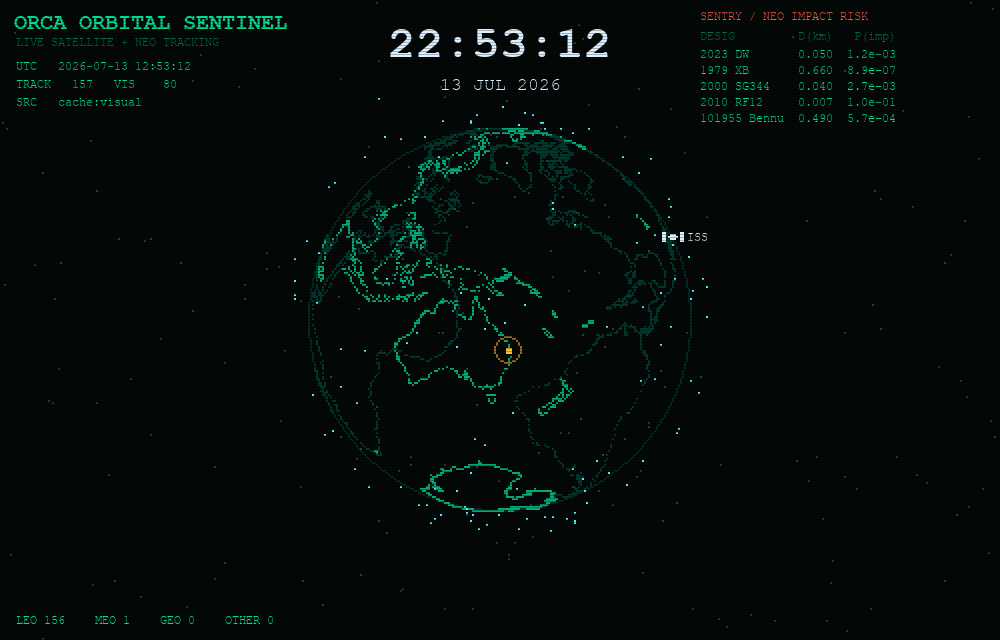
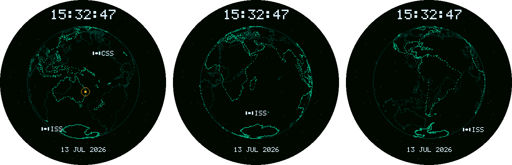

# ORCA Orbital Sentinel

A retro-LCD Earth that traces the continents as dots, tracks live satellites and the
crewed space stations in real time, marks your own city on the globe, and doubles as a
clock. Built by [ORCA](https://github.com/roboticsmick).



Orbital positions are real: TLEs from CelesTrak, propagated with SGP4, in whatever
build you run - desktop or microcontroller.

## Two builds

| | [**Desktop**](#desktop-quick-start) (Python) | [**Round display**](ESP32S3_orbital_sentinel/README.md) (C++ firmware) |
| --- | --- | --- |
| Runs on | Windows / macOS / Linux | Seeed XIAO ESP32-S3 + Seeed Round Display |
| Screen | Any window, or fullscreen | 1.28", 240x240, round |
| Tracks | Hundreds of objects | ISS + CSS (the two crewed stations) |
| Extras | NASA/JPL Sentry impact-risk panel, CRT scanlines, screensaver mode | Wi-Fi, SNTP, standalone - no PC needed |
| Start here | [Quick start](#desktop-quick-start) | [`ESP32S3_orbital_sentinel/`](ESP32S3_orbital_sentinel/README.md) |

The round-display firmware is a **standalone desk clock that happens to track
spacecraft**. It is not a port of the Python code - it is a C++ reimplementation of the
same portable core (SGP4, projection, rasterisation), so it runs with no computer
attached:



The globe spins; your location pings whenever the Earth's rotation brings it into view.
Those are real frames from the firmware's own renderer - see
[Preview it without hardware](ESP32S3_orbital_sentinel/README.md#preview-it-without-hardware).

## Features

- Dotted globe from real public-domain Natural Earth coastline data (bundled, works offline).
- Live satellite tracking via CelesTrak GP/TLE data, propagated with SGP4.
- Crewed stations (ISS and China's CSS/Tiangong) drawn as labelled satellites, not dots.
- Large local date and time above the globe - **real** wall-clock time, so it works as a
  clock even when the orbits are running accelerated.
- Your own location marked with a dot that pings - an expanding ring - whenever the
  Earth's rotation brings it onto the visible hemisphere.
- Front/back hemisphere shading and globe occlusion for a genuine 3D read.
- NASA/JPL Sentry near-Earth-object impact-risk panel (desktop).
- Config-driven filtering: show only what you want (by id, name, altitude band, or count).
- Fullscreen / screensaver mode that fills the screen at native resolution.
- Compact small-screen mode for LCD/OLED panels.
- Retro aesthetic: chunky upscaled pixels, phosphor palette, CRT scanlines.
- Graceful degradation: live -> local cache -> optional TLE file -> synthesized demo.

## Desktop quick start

Requirements: **Python 3.9+**, and a graphical session (X11, Wayland, Windows, or macOS).

```bash
git clone https://github.com/roboticsmick/ORCA_orbital_sentinel.git
cd ORCA_orbital_sentinel
python3 -m venv .venv && source .venv/bin/activate   # Windows: .venv\Scripts\activate
pip install -r requirements.txt
python run.py
```

| Command | What it does |
| ------- | ------------ |
| `python run.py` | Windowed. |
| `python run.py --fullscreen` | Fills the screen at its native resolution. |
| `python run.py --screensaver` | Fullscreen; exits on any key or mouse movement. |
| `python run_lcd.py` | Compact 240x240 panel mode (desktop preview). |
| `ORCA_OFFLINE=1 python run.py` | No network: cache / fallback / synthesized demo. |

Controls: `Space` pauses, `Esc` or `Q` quits.

Python packages (see `requirements.txt`): `numpy`, `pygame`, `requests`, `sgp4`.

> On Python 3.13+, if `pygame` fails to build, install the maintained fork instead:
> `pip install pygame-ce` (a drop-in replacement - same `import pygame`).

## Make it yours

Everything lives in `orca_orbital_sentinel/config.py`. The knobs you are most likely to
touch:

### Your location

Marked with a pinging dot. **South and west are negative.**

```python
HOME_ENABLED = True
HOME_LAT = -27.4698      # Brisbane
HOME_LON = 153.0251
```

### The clock

Reads your machine's local timezone and always shows **real** wall-clock time, even when
`TIME_ACCELERATION` is running the orbits fast - a clock that lies is useless. The
simulated UTC the physics is actually using stays visible in the telemetry block on the
left. Set `CLOCK_ENABLED = False` to hide it.

### Everything else

- `CELESTRAK_GROUP` - which satellites to track. Default `visual` (~150 bright,
  well-spread objects; polite on bandwidth). Set to `active`, `starlink`, `gps-ops`,
  etc. for a denser swarm.
- `TIME_ACCELERATION` - simulated seconds per real second. Default `60` (one ISS orbit
  every ~90 s). Set to `1` for real-time.
- `SPIN_DEG_PER_SEC` - cosmetic camera spin rate (does not affect physics).
- `GLOBE_RADIUS_FRAC`, `WINDOW_W/H`, `LOGICAL_SCALE` - size and pixel chunkiness. In
  fullscreen the window size comes from the monitor instead, and `WINDOW_H` becomes the
  reference height the HUD text is scaled from (so a 1080p screen renders the chrome at
  ~1.7x).
- `COL_*` - the palette. `COL_LED` is the one pale blue shared by the clock, the date,
  and both stations; give `COL_ISS`/`COL_CSS` distinct values to tell the two apart by
  colour instead of by label.

## Filtering (limiting what is shown)

Filtering runs once at load, so a tighter filter also means fewer objects to propagate
each frame - a lighter, faster view. Set any of these in `config.py` (leave as `None` to
ignore):

- `FILTER_INCLUDE_IDS` - a set of NORAD ids to show exclusively, e.g. `{25544, 48274}`.
- `FILTER_EXCLUDE_IDS` - ids to drop.
- `FILTER_NAME_CONTAINS` - keep only names containing a substring (e.g. `"STARLINK"`).
- `FILTER_MIN_ALT_KM` / `FILTER_MAX_ALT_KM` - keep only a given altitude band.
- `FILTER_MAX_COUNT` - hard cap after the above.

Stations listed in `STATION_LABELS` are always drawn as labelled satellite icons when
present. Add more `id -> label` / `id -> colour` entries to mark other objects.

## Screensaver / lock screen (Ubuntu, GNOME + X11)

`--screensaver` (or `ORCA_SCREENSAVER=1`) runs fullscreen and exits on the *first* key
press or mouse movement, instead of Space toggling pause. That makes it a suitable
idle-time visual, but it does not authenticate anyone - GNOME's own lock (your real login
password) stays completely in charge of actually securing the session. The `screensaver/`
folder wires the two together: an idle watcher locks the session and shows the globe
fullscreen a few seconds before GNOME's own idle timer would otherwise blank the screen;
dismissing the globe (any key/mouse input) just reveals GNOME's already-active unlock
prompt underneath.

```bash
sudo apt install xprintidle       # used to detect idle time on X11
```

Install the watcher as a per-user systemd service:

```bash
mkdir -p ~/.config/systemd/user
ln -s /path/to/ORCA_orbital_sentinel/screensaver/orca-screensaver.service \
      ~/.config/systemd/user/orca-screensaver.service
systemctl --user daemon-reload
systemctl --user enable --now orca-screensaver.service
```

Check it's running / see logs:

```bash
systemctl --user status orca-screensaver.service
journalctl --user -u orca-screensaver.service -f
```

By default it triggers 20 s before `gsettings get org.gnome.desktop.session idle-delay`
(880 s vs. the default 900 s / 15 min). Override with `ORCA_IDLE_MS` (edit the
`Environment=` line in the `.service` file, or the default at the top of
`orca-screensaver-watch.sh`) if you change that GNOME setting. To stop using it:

```bash
systemctl --user disable --now orca-screensaver.service
```

This is X11-only (`xprintidle` reads the XScreenSaver extension's idle counter); it will
not work under a Wayland session.

## Small screens / LCD panels

A compact mode renders at a panel's native resolution (default 240x240, suited to an
ST7789 TFT) and, by default, shows only the two crewed stations.

Preview it on the desktop (upscaled window):

```bash
python run_lcd.py
# or
python -m orca_orbital_sentinel --small
```

Drive a real SPI panel on a Raspberry Pi:

```bash
pip install luma.lcd pillow          # hardware-only extras
ORCA_DISPLAY=spi python run_lcd.py
```

Typical ST7789 wiring (Raspberry Pi 40-pin):

| Panel | Pi pin        |
| ----- | ------------- |
| VCC   | 3V3           |
| GND   | GND           |
| SCL   | SCLK (GPIO11) |
| SDA   | MOSI (GPIO10) |
| RES   | GPIO25        |
| DC    | GPIO24        |
| CS    | CE0 (GPIO8)   |
| BLK   | 3V3           |

Choose what the small screen shows via `SMALL_INCLUDE_IDS`, `SMALL_GROUP`, and the panel
size (`SMALL_W`, `SMALL_H`) in `config.py`. For a monochrome SSD1306 OLED, set `SMALL_W/H`
to `128`/`64`, install `luma.oled`, and point `SpiPanelSink` at the `ssd1306` device (the
sink is a thin, documented adapter in `hardware.py`). The `DisplaySink` boundary means the
renderer itself is unchanged across panels.

**For a self-contained, Wi-Fi-connected round panel with no PC attached, use the
[ESP32-S3 build](ESP32S3_orbital_sentinel/README.md) instead.**

## Data sources and rate limits

- **Satellites:** CelesTrak GP data (`https://celestrak.org`). CelesTrak refreshes roughly
  every two hours and firewalls abusive pollers, so this app caches downloads and never
  refetches faster than `TLE_CACHE_TTL_S` (default 3 h). Do not lower that without reason.
- **Near-earth objects:** NASA/JPL CNEOS Sentry API
  (`https://ssd-api.jpl.nasa.gov/sentry/`), cached for 24 h. The JPL terms ask for one
  request at a time and no embedding the API in a website; this client honours that. API
  formats can change without notice, so the code checks defensively and degrades to sample
  rows on any failure.

Note: CelesTrak is retiring the legacy 5-digit-catalog TLE text format as the catalog
passes 69999 (mid-2026). The propagator here is format-agnostic, but a future revision
should prefer CelesTrak's OMM (JSON/CSV) output for longevity.

## Offline behaviour

With no network (or `ORCA_OFFLINE=1`) and no cache, the app draws a **synthesized demo
constellation** (SGP4-valid, deterministic) so the globe is never empty. To pin your own
real objects for offline use, drop a standard 3-line TLE file at
`orca_orbital_sentinel/data/fallback_tle.txt`; it is used ahead of the demo.

## Architecture

```text
config.py       tunables, palette, home location, filters   (no logic)
propagate.py    SGP4 + TEME->ECEF + geodetic transforms     <- portable core
camera.py       orthographic projection and occlusion       <- portable core
coastline.py    bundled Natural Earth dots -> ECEF cloud    <- portable core
filters.py      declarative object filter (id/name/alt/count)
tle_source.py   cached CelesTrak fetch + fallback chain     <- data layer
sentry.py       cached JPL Sentry NEO rows                  <- data layer
render.py       desktop renderer (pixels + HUD + clock)     <- renderer
render_small.py compact panel renderer                      <- renderer
hardware.py     display sinks: desktop preview or SPI panel <- output
app.py          desktop simulation loop and wiring
app_small.py    compact/LCD simulation loop and wiring
```

The `propagate`/`camera`/`coastline` trio is intentionally free of any display dependency:
it turns time into an abstract set of screen points. Porting to a new target means writing
a new renderer against that same point stream, not rewriting the simulation - which is
exactly what the [ESP32-S3 build](ESP32S3_orbital_sentinel/README.md) does in C++.

### A note on the camera

The camera sits at `+Y` looking at the origin with `+Z` up, so screen-right is `-X`
(`right = view_dir x up = (-Y) x (Z) = -X`). Earlier revisions used `+X`, which drew the
Earth **mirrored east-west** - longitude increased to the left, so Perth rendered east of
Brisbane. The coastline was mirrored by exactly the same amount, so the globe still read
convincingly as Earth and the bug went unnoticed for a long time. It only became obvious
once a *known* city was plotted on it. If you ever touch `camera.py`, keep the sign.

## Repository layout

```text
ORCA_orbital_sentinel/
|-- assets/                          preview images
|-- orca_orbital_sentinel/           the Python package (see Architecture)
|   `-- data/                        bundled coastline + optional offline TLE file
|-- ESP32S3_orbital_sentinel/        standalone C++ firmware for the Seeed Round Display
|   |-- orbital_sentinel/            the Arduino sketch (portable SGP4 + renderer)
|   `-- tools/                       coastline baker + host preview harness
|-- screensaver/                     GNOME/X11 idle-watcher systemd unit + script
|-- run.py                           desktop launcher
|-- run_lcd.py                       small-screen/LCD launcher
`-- requirements.txt
```

## Troubleshooting

- **`pip install pygame` fails on Python 3.13+:** use `pip install pygame-ce`, the
  maintained drop-in fork.
- **Wayland vs X11:** the app is a normal window and runs on both. (True animated
  *wallpaper* is a separate, harder problem on GNOME/Wayland and is intentionally out of
  scope here.)
- **No display / SSH:** for a headless render, set `SDL_VIDEODRIVER=dummy` and save frames
  with `pygame.image.save`; there is no live window in that mode.
- **`pygame` fails to open a window:** ensure you are in a graphical session and that SDL
  can reach your display server.
- **Fullscreen looks sluggish on a 4K screen:** the scene is rendered at native
  resolution, so there are more pixels to rasterise. Raise `LOGICAL_SCALE` to `3` - the
  scene shrinks, the pixels get chunkier, and that suits the aesthetic anyway.
- **`pip install` reports dependency conflicts for unrelated packages** (e.g.
  `openhsi-ros2 requires netcdf4, which is not installed`): harmless. It means a ROS
  environment (or similar) is sourced in your shell and its `PYTHONPATH` leaks into the
  venv, so pip's resolver notices those unrelated packages too. It does not affect this
  project. To silence it, unset `PYTHONPATH` before creating the venv:
  `unset PYTHONPATH && python3 -m venv .venv`.

## Roadmap

- Native lock-screen/screensaver integration for Windows and macOS.
- XScreenSaver hook (`-window-id`) as the Linux screensaver renderer.
- Raspberry Pi fullscreen kiosk build (round/square display).
- OMM (JSON) ingestion to survive the 6-digit catalog transition.
- Optional GLSL post-process (bloom, barrel distortion) on the upscale.

Done: satellite station markers, object filtering, a compact LCD/OLED mode with a
swappable display sink, a large local-time clock and home-location ping, a fix for the
long-standing mirrored-globe bug, edge-to-edge fullscreen, and a standalone
[ESP32-S3 round-display build](ESP32S3_orbital_sentinel/README.md) with the core (SGP4,
projection, rasterisation) ported to portable C++ and verified against the reference SGP4
implementation.

## Licensing / attribution

Coastline geometry derives from Natural Earth (public domain). Orbital data from CelesTrak
and NASA/JPL CNEOS are subject to their respective terms; review them before
redistributing cached data. The ESP32 build depends on
[Seeed_GFX](https://github.com/Seeed-Studio/Seeed_GFX) (a fork of TFT_eSPI), which is not
vendored here - see its README for install instructions and its own licence.
